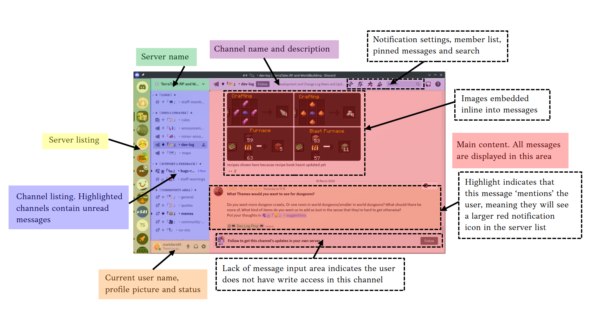
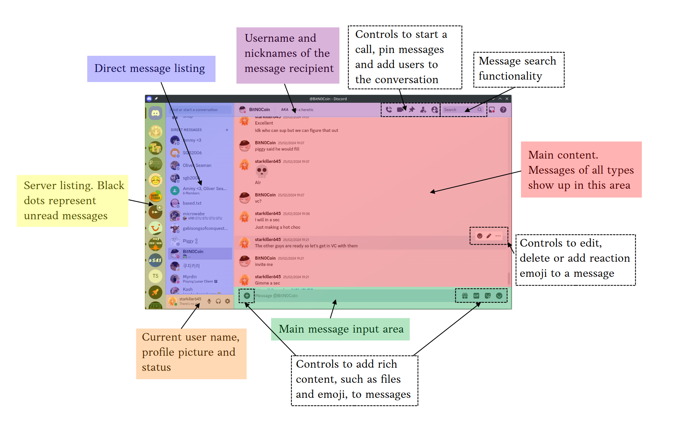
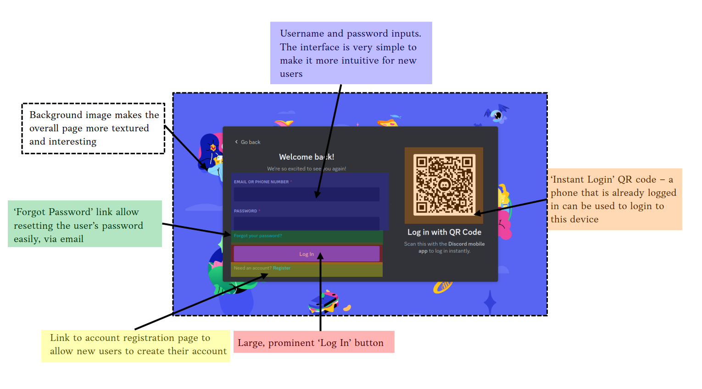
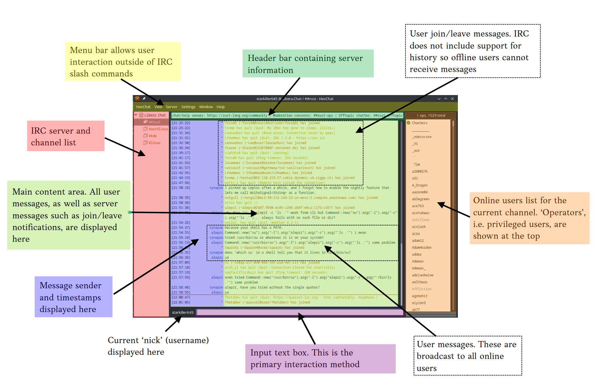
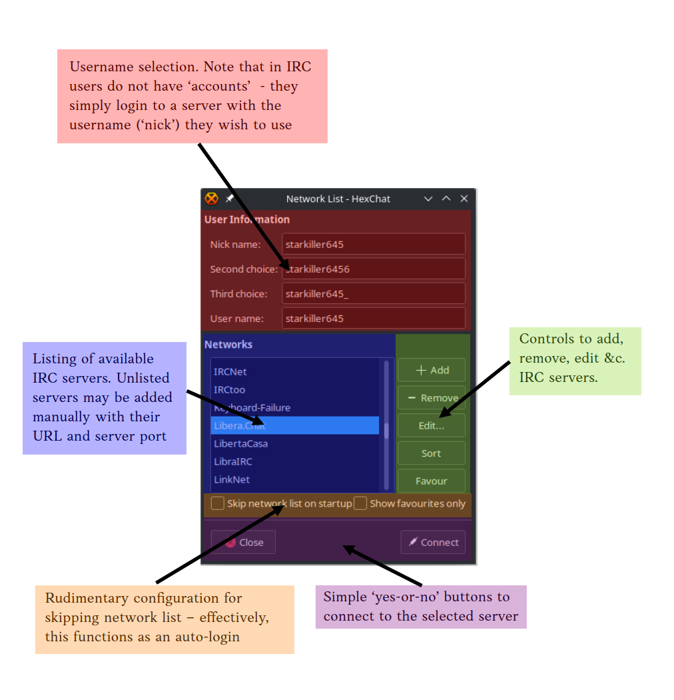

# NChat - Project Analysis

## Abstract
For my project, I am planning to create an internet chat client, similar to software such as Discord and IRC (Internet Relay Chat). The application will incorporate end-to-end encryption, for which I will write an implementation based on the Signal protocol. It will be written using the Rust language, and will operate using a distributed client-server architecture; this means that user data, including messages, may be stored on an independent server which will be able to communicate with all other servers in a way that is transparent to the user.  
The application will allow users to set a profile picture and profile which will be visible to other users. Users will only be able to communicate with other users who have accepted a request to chat. In a similar way to IRC, users will be able to create 'hubs', each of which may have many channels dedicated to specific topics. Each hub and channel may have its own description and icon similar to user profiles. I may implement voice chat,  using VoIP technology, if the scope of the project permits it. The project will use an intuitive GUI for all actions, with keybindings to make it easier to user - these will be annotated on-screen to the user.  

## Computational Methods
A chat application such as NChat is well-suited to a computational approach, as the problems it aims to address cannot be solved without the use of a computer. End-to-end encryption is very difficult to achieve securely without the complex numerical techniques a computer can employ, and the networked aspect of NChat would be impossible to achieve in real-time without use of the internet to transmit messages.  
### Abstraction
Abstraction is the removal of unnecessary detail from a problem in order to simplify its implementation. For NChat, I will make use of abstraction to:  
- Reduce user information down to an easy-to-read, concise user profile, so users are not overwhelmed by information
- Hide the implementation of end-to-end encryption from the user, as it is unnecessary for them to understand the complex encryption process
- Implement a simple, intuitive design for all pages within the NChat Client, to allow users to quickly learn how it is used
- Hide the underlying WebSocket communication protocol from the user; again, this is unnecessary information for them
- Implement desktop notifications to inform the user when a new message has been received, which will prevent them having to check the application continuously
### Decomposition
Decomposition is the breaking-down of a problem into smaller constituent parts, which can be worked on independently. This is useful for NChat as it allows the code to be better organised and prevents a mistake in one part of the program from affecting the rest of it. Therefore, NChat will be broken down into a set of components, which will be described in greater detail in the Design section and will be implemented as Rust modules. In brief, the components are as follows:  
- **NChat Client**: 
    - comms: Handles asynchronous, two-way communication between the client and server
    - pages: Handles dynamic pages within the client application, which uses the Dioxus GUI framework
    - encryption: Handles encryption and decryption of E2E messages, using the Signal protocol, as well as key storage
    - desktop: Handles interactions with the desktop environment and OS, including data storage, window raising, opening of web browsers, &c.
    - types: Contains type declarations for all types used in the NChat Client. May be spun off later into a separate crate
- **NChat Server**:
    - comms: Handles asynchronous, two-way client-server communication, as well as inter-server communications
    - pages: Handles building and serving of webpages, using the Rocket framework
    - database: Handles all communication with the SQL database that will store messages, user data &c.
    - tokens: Handles issuing, validating and revoking OAuth access and refresh tokens
    - types: Contains type declarations for all types used in the NChat Server. May be spun off later into a separate crate
More of these components may be added at the design stage, where I will properly describe the function of each as well as their key features.  

### Networking
Networking plays a key role in chat applications such as NChat - without it they would not be able to operate. This principle refers to the sharing of data between devices that are located remotely from each other, most commonly over the TCP/IP layered protocol. In NChat, networking will be used in three separate areas:  
- **Client <-> Server**: The NChat client and server applications will be in real-time, bi-directional communication with each other, using the WebSocket protocol with data encoded as JSON.
- **Server <-> Server**: NChat uses a *distributed* server architecture, which means that a user who chooses to sign up on one server should be able to communicate with users hosted on other servers. Therefore, servers will communicate, using the same WebSocket + JSON protocol, in order to facilitate this. Note: servers *will not* be able to read the content of the messages they forward.
- **Client -> Internet**: If there is time, I would like to allow NChat to fetch a preview of web links that are included in message content. This will be done client-side, as it requires the decryption of the message first.

### Concurrency
NChat will be designed to be fully asynchronous from the start in both the client and server, to avoid bottlenecks while data is processed or fetched. I will use concurrency in:  
- **NChat Client**:
    - a separate process will run in parallel to the main UI thread, handling all communication with the NChat server while the GUI remains smooth and performant.
    - a minimal subset of this process may continue running when the GUI is shut down - this will allow messages to be received while the application itself is closed
- **NChat Server**:
    - the design of the Rocket library which I will use is fully multi-threaded by default, which means each incoming web request can be handled in its own thread, improving performance
    - database access will use the SQLx library which makes use of async functions to avoid blocking the main thread
    - file access and other utilities such as thread-safe mutexes and pointers are provided by the Tokio library which is fully asynchronous

## Stakeholders
This project will primarily be aimed at players of online videogames, therefore the target age range will be approximately 16-25. I will design NChat to be intuitive and easy-to-use, allowing new users to quickly learn how to use it, while also allowing for power-user features such as fast keyboard shortcuts and a global command bar inspired by IRC slash commands. This will allow users of all levels of familiarity with NChat to use it efficiently. Initially, I will release NChat for the desktop platform only. I will use the cross-platform GUI framework Dioxus to allow it to run on Windows, MacOS and Linux without significant code changes, which will allow the greatest number of users to use NChat at launch, and also allow me to develop on Linux which significantly reduces development time due to the OS's better support for the Rust compiler and development toolchains in general.  
I have selected a user to represent my target audience, Amelia Quinlivan. She is a student at my sixth form who makes extensive use of Discord, as well as other online chat platforms, to message her friends over the internet. Therefore, she will have a good working knowledge of required features in chat clients, as well as an understanding of the limitations of platforms such as Discord which can be addressed in NChat. As part of my research, I will conduct an interview with her to establish basic requirements for the NChat client software, as well as any 'nice-to-have' features which may be added if there is sufficient time.  

## Research
I will research two different pieces of software, both well-established internet chat applications: Discord, which is a contemporary online messaging platform used primarily by the online videogame community, and HexChat, which is a client for the Internet Relay Chat messaging protocol which was introduced in 1988 and continues to be used, mostly by developers. Additionally, I will conduct an interview with my representative stakeholder, which will allow me to better understand the requirements of the target market for NChat.  

### Discord
Discord is an internet messaging application first released in 2015 and aimed at the online videogaming market. The developers wanted to create an easy-to-use VoIP and chat software to facilitate communication in online videogames such as *League of Legends* and *Final Fantasy*.  
The main interface of Discord is presented as two sidebars with a main content area and optional popout drawer on the right of the screen, as well as a header bar containing information about the current chat. Users can message up to 10 people via direct message, or may join 'servers' which are communities of users operating around a central topic, with multiple separate text and voice 'channels' - NChat will use a similar system of 'hubs' and 'channels'. Discord includes robust support for image- and file-sharing, as well as real-time streaming of users' desktops or individual applications. Discord may be accessed from the desktop application, iOS and Android apps or a compatible web browser.  
Discord uses the same client-server architecture that NChat will, but unlike NChat uses a principle known as 'Eventual Consistency' - this requires, as the name suggests, that data eventually becomes consistent across all clients and the server, but does *not* guarantee consistency at the time of a data update; this can lead to clients becoming desynchronised and/or messages failing to send, a problem I have experienced first-hand and one that will be solved in NChat through the use of an authoritative server state. Data storage, for client settings and preferences in addition to messages, is almost entirely cloud-based - in NChat I will make minimal use of cloud storage which reduces the need for data protection and also reduces implementation complexity, but will mean the majority of user settings are not synced between devices.  
Below are annotated screen captures of the Discord desktop application:  

### HexChat
HexChat is a client for the Internet Relay Chat (IRC) protocol, released in 2010, although it is a fork of a project called XChat which has been around for longer. In contrast to Discord, HexChat was designed around familiarity with old, console-based IRC clients. This has meant that it is much less approachable and intuitive, but the interface is far simpler and less cluttered.  
As IRC was developed before GUIs became mainstream, much of the user interaction is done via commands typed in the input box, prefixed with a slash. It could be worth implementing this as a shortcut mechanism in NChat - as part of my interview I will pose this question. HexChat's GUI is very simple - a sidebar on each side of the screen, showing servers, channels and users online in the selected channel; a bar at the top showing the channel description, an input box at the bottom, and the rest of the screen area dedicated to the messages sent in the channel. A significant limitation of IRC is that a user must be online to read messages - there is no history functionality easily available. I will of course avoid this limitation in NChat.  
Below are annotated screen captures:  

### Interview

